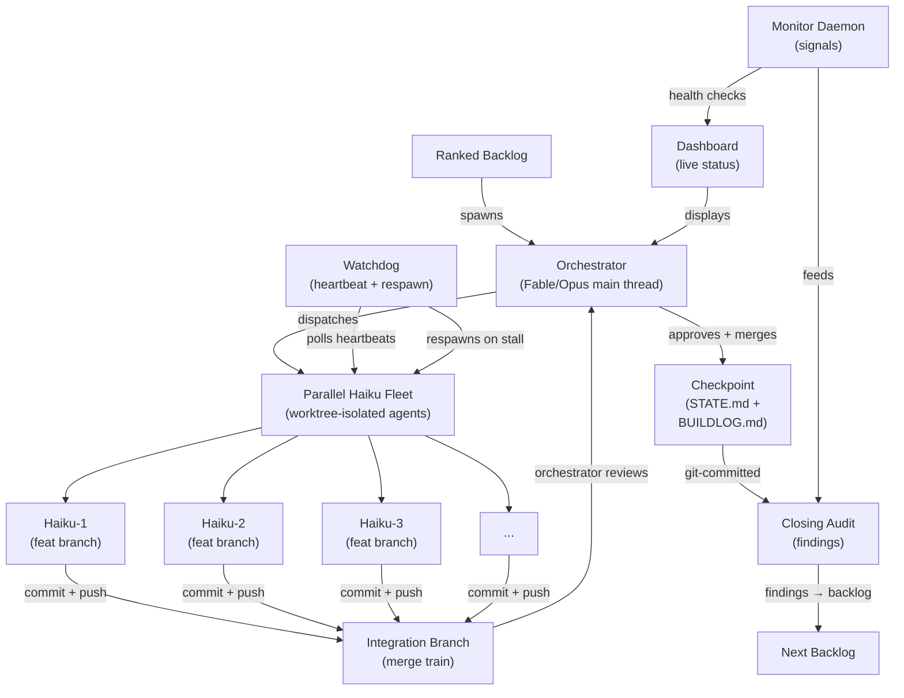

# Architecture

Aesop's architecture is designed for **low cost, high parallelism, and durable state**. This page shows the system architecture with one wave cycle diagram.

---

## System Architecture Diagram



---

## Component Overview

### 1. Ranked Backlog

The input to a wave. Backlog items are:

- **Ranked** by priority (P1: blockers, P2: quality, P3: debt)
- **Sized** for Haiku (3–10 min per agent)
- **Scoped** (one agent per item, no dependencies)

**Owned by**: You (at wave start)

---

### 2. Orchestrator (Main Thread)

**Fable or Opus** orchestrator on the main thread.

**Responsibilities**:
- Reads STATE.md, BUILDLOG.md, MEMORY.md (durable state)
- Ranks backlog into actionable items
- Spawns Haiku agents in parallel
- Monitors watchdog signals
- Reviews PRs and approves merges
- Conducts closing audit

**Why main thread?** Preserves context, warms prompt cache, avoids orchestrator-as-subagent (too expensive).

---

### 3. Parallel Haiku Fleet

**5–8 Haiku agents** running in parallel, each in its own worktree.

**Each agent**:
- Gets a **scoped brief** (what to build, acceptance criteria)
- Works in a **sibling worktree** (no conflicts with primary tree or other agents)
- Commits + pushes to a **feature branch**
- Opens a **PR** when done

**Cost benefit**: Haiku is ~1/3 Sonnet, 1/5 Opus. Running 5 in parallel = faster + much cheaper than serial Opus.

**Worktree isolation**: Each agent uses `git worktree add ../wt-<agent-name>` to ensure:
- No conflicts (agents don't interfere)
- Safe parallelism (each has its own git checkout)
- Easy cleanup (delete worktree on completion)

---

### 4. Watchdog (Background Daemon)

**Purpose**: Detect hung agents and respawn them automatically.

**Polling**:
- Every 10s: check agent heartbeats
- Every 150s: run full backup (secret-scan, drift check, state backup)

**On stall** (>200s idle):
1. Ping agent (is it responsive?)
2. If no response: TaskStop + relaunch (auto-retry 1–3)
3. After 3 retries: mark BLOCKED and surface to user

**Why**: Prevents silent hangs, keeps fleet healthy, gives humans visibility into failures.

---

### 5. Integration Branch (Merge Train)

All feature branches are merged into a **integration branch** (e.g., `integration/wave-23`) in sequence.

**Orchestrator**:
1. Reviews each PR (code review, test coverage)
2. Approves if green
3. Merges to integration branch
4. Runs integration tests on the combined result

**Why ordered merge?** If one PR causes an integration failure, you know exactly which one. Easier to debug than merging all-at-once.

---

### 6. Checkpoint (STATE.md + BUILDLOG.md)

After all merges succeed, **commit STATE.md and BUILDLOG.md to git**.

**STATE.md** (hand-maintained):
- Current phase (e.g., "Phase 4: Closing audit")
- Locked decisions
- Explicit NEXT STEPS

**BUILDLOG.md** (append-only):
- Timestamped work snapshots
- Status (green / blocked / pending)
- Recent blocker or next action

**Why git-committed?** Survives machine wipes. On resume, read them and sync from disk (no data loss).

---

### 7. Closing Audit

Before the next wave, **audit** this wave:

**Checks**:
- Did all agents follow rules? (branch discipline, secret-scan gate, test coverage)
- How many retries did watchdog need?
- What bottlenecked? (long tasks, slow external APIs, etc.)

**Findings** → feed into next wave's backlog:
- "Config loader took 35 min; consider pre-writing scaffold" → P2 for wave 24
- "Dashboard tests are thin; expand coverage" → P2 for wave 24

---

### 8. Monitor Daemon (Side Observer)

**Background process** that collects health signals:

- Agent heartbeats and task status
- Fleet cost tracking
- Security events (secret-scan blocks, branch violations)
- Custom health checks (extensible via `monitor/collect-signals.mjs`)

**Outputs**:
- `BRIEF.md` — Snapshot of fleet health
- `SIGNALS.json` — Structured data for dashboard
- `.monitor-heartbeat` — Liveness marker

**Why separate?** Decouples observability from orchestration. Signals feed into audit, not directly into agent dispatch.

---

### 9. Dashboard (Live Status)

**Web UI** at http://localhost:8770 (runs `python ui/serve.py`).

**Feeds from**:
- Monitor daemon signals
- Orchestrator state (STATE.md, BUILDLOG.md)
- Cost ledger (token spend, per-model breakdown)

**Views**:
- **Overview** — Fleet agents, recent events, security alerts
- **Work** (#/work) — Task kanban (proposed → ranked → in-progress → done)
- **Activity** (#/activity) — Agent timeline, main-thread reasoning
- **Cost** (#/cost) — Per-model spend, per-day chart, verdict scorecard

**Why observability matters?** You can see exactly what's happening without reading logs. Faster decisions, faster recovery.

---

### 10. Next Backlog (Feedback Loop)

Findings from closing audit feed into the **next wave's backlog**:

- Learnings from this wave
- Tech-debt opportunities discovered during implementation
- Performance/UX improvements suggested by agents
- Scaling improvements (e.g., "cache this lookup")

**Result**: Each wave improves on the last. The system learns continuously.

---

## Durable State Model

```
STATE.md ──┐
BUILDLOG.md├──→ git commit ──→ git push ──→ Survives machine wipe
MEMORY.md ─┘
```

On resume:
1. Read STATE.md → understand intent, current phase, NEXT STEPS
2. Skim BUILDLOG.md → review recent progress
3. Run git log → verify actual file state
4. Sync → if STATE.md is stale, update before proceeding

**Zero data loss**: Durable state on disk (git) is source of truth.

---

## Cost Model

| Component | Cost | Notes |
|-----------|------|-------|
| Orchestrator (Opus) | ~$0.02 per wave | Main thread, lean context, 5–10 min reasoning |
| Haiku fleet (5 agents) | ~$0.01–0.02 per wave | 1/5 cost per token vs Opus |
| **Total** | **~$0.03–0.05 per wave** | 4–5x cheaper than all-Opus fleet |

**Key lever**: Haiku-first dispatch. Every subagent defaults to cheap tier (Haiku). Orchestrator stays lean. Result: maximum savings at scale.

See [DISPATCH-MODEL.md](DISPATCH-MODEL.md) for detailed cost analysis and patterns.

---

## Security Model

### Pre-push hook (local enforcement)

Every push is gated:

1. **Branch check**: Reject pushes to `main` / `master` (must use `feature/*`)
2. **Secret-scan**: Scan staged files for detected credentials (API keys, tokens, passwords)

**Script**: `hooks/pre-push-policy.sh`

### GitHub branch protection (real enforcement)

For production, pair with GitHub:

```
Settings > Branches > main
  ✓ Require pull request reviews
  ✓ Require status checks to pass
  ✓ Dismiss stale PR approvals
  ✓ Restrict pushes to (Admins only)
```

See [HOOK-INSTALL.md](HOOK-INSTALL.md) for setup.

---

## Scaling Characteristics

### Parallelism

- 5 agents in parallel = ~3x wall-clock speedup vs serial
- 8 agents in parallel = ~4x speedup (diminishing returns beyond 10 agents due to orchestrator overhead)

### Cost

- Haiku-first dispatch = ~1/5 cost per token vs Opus
- 5 Haiku + 1 Opus orchestrator = ~25% cost of all-Opus fleet

### Reliability

- Durable state (git-committed) = zero data loss on wipe
- Watchdog (heartbeat + respawn) = auto-recovery from hung agents
- Append-only logs = auditable, no corruption

---

## Next Steps

- **[HOW-THE-LOOP-WORKS.md](HOW-THE-LOOP-WORKS.md)** — Detailed wave cycle walkthrough
- **[DISPATCH-MODEL.md](DISPATCH-MODEL.md)** — Cost analysis and dispatch patterns
- **[CHECKPOINTING.md](CHECKPOINTING.md)** — STATE.md / BUILDLOG.md lifecycle
- **[FIRST-WAVE.md](FIRST-WAVE.md)** — Run your first wave and see the architecture in action
